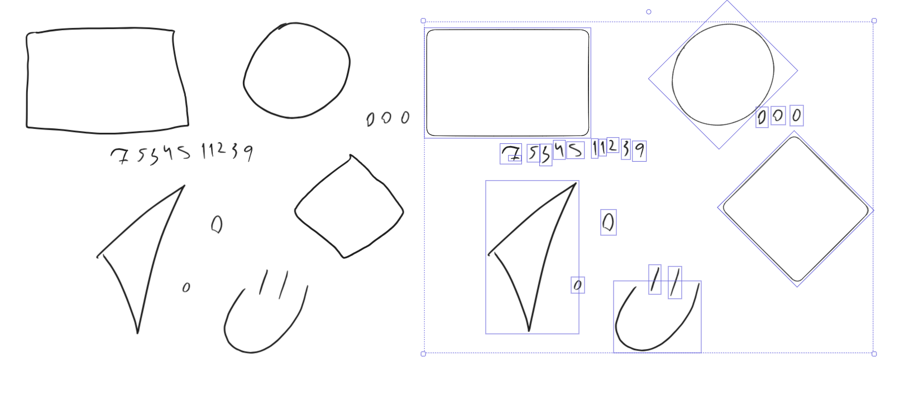

## Diagramming assist: shape recognizer
It implements [protractor](https://depts.washington.edu/acelab/proj/dollar/protractor.pdf) (with minor differences) for basic shape recognition, and after some bug fixing and code clean up it may actually become useful one day. I intend to keep the core dumb so that i can always rewrite it in Ts in single-query mode and PR to Excalidraw

### The plan
- clean up the code
- fix bugs:
  - orientation is weird, especially when clipping it in the optimal angle solver
  - scale inference is unreliable
  - rotation isnt compensated when creating new objects (they are too large)
  - position of new objects is sometimes funny
- make it fast
- add more shapes:
  - clever arrow detection tricks
  - composite shapes like the database symbol
- make space for pipelines, filters, renderers etc
- consider discrete diffs for better resolution
- consider iterated integral signatures -> classifier pipeline
- add a renderer -> im2latex pipeline
